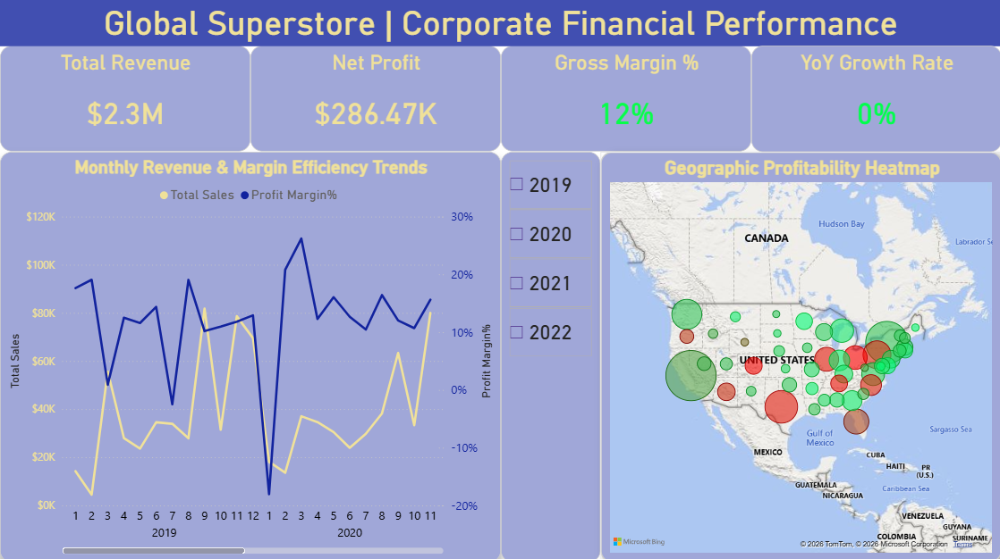
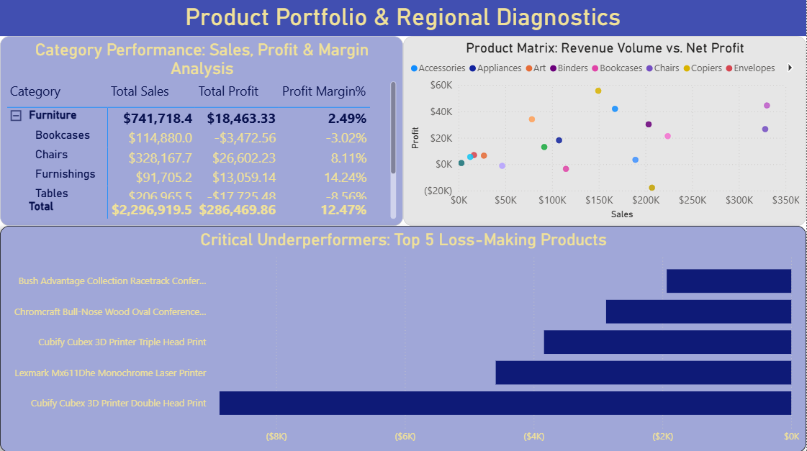
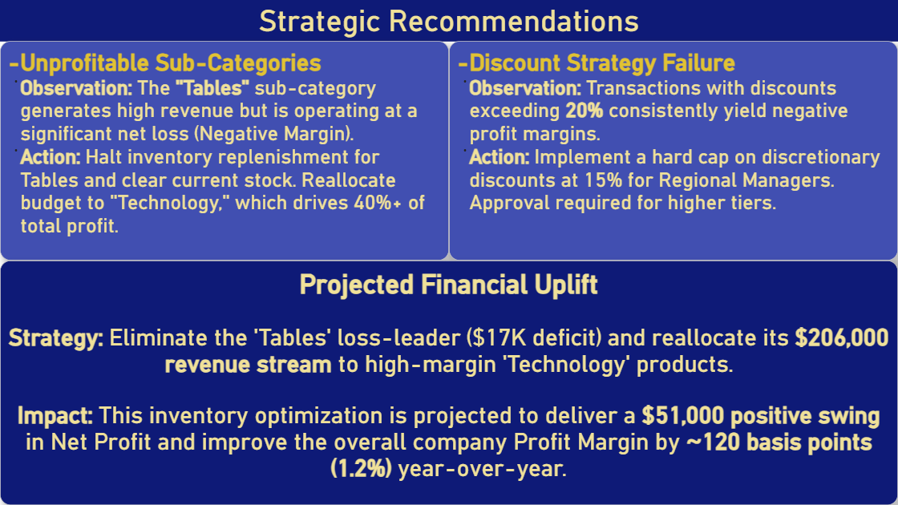

# 💰 Global Superstore | Corporate Financial Analysis

### 📊 Project Overview
**Goal:** Transform raw transactional data into a prescriptive decision-making tool. This project goes beyond descriptive analytics to identify margin leakage, loss-making SKUs, and discount strategy failures.
**Tools:** Power BI, DAX, Power Query.

---

### 🖼️ Dashboard Showcase

**Page 1: Executive Overview**

*High-level view of Net Sales, Profit Margins, and YoY Growth trends.*

**Page 2: Product & Regional Diagnostics**

*Deep-dive matrix and scatter plots identifying "Profit Killers" (High Revenue / Negative Margin).*

**Page 3: Strategic Action Plan**

*Executive summary quantifying the financial uplift of specific interventions.*

---

### 🎯 Business Objective
In a retail environment where revenue can be misleading, margin discipline is critical. This dashboard answers three core questions:
1.  **Portfolio Health:** Which sub-categories are driving profit vs. destroying value?
2.  **Pricing Strategy:** At what threshold do discounts erode profitability?
3.  **Optimization:** What specific capital reallocations will improve the corporate bottom line?

---

### 🔎 Key Findings & Strategic Recommendations

#### 1. The "Revenue Trap" (Unprofitable Sub-Categories)
* **Observation:** The **"Tables"** sub-category generates high revenue volume but operates at a negative profit margin, creating a **~$17K direct loss**.
* **Diagnosis:** High sales volume ≠ healthy profitability. This is a classic "hollow revenue" scenario.
* **Action:** Halt inventory replenishment for Tables and clear existing stock.

#### 2. Discount Strategy Failure
* **Observation:** Transaction analysis reveals that discounts exceeding **20%** consistently yield negative margins.
* **Conclusion:** Excessive discretionary discounting is the primary driver of margin erosion in specific regions.
* **Policy Recommendation:** Cap discretionary discounts at 15% and shift focus to value-based selling.

#### 3. Financial Uplift Simulation
* **Scenario Modeled:** A calculated projection based on eliminating the $17K loss from "Tables" and reallocating its **$206K revenue stream** to the high-margin "Technology" category (~40% margin contribution).
* **Projected Impact:**
    * **~$51,000** positive swing in Net Profit.
    * **~120 basis point (1.2%)** improvement in overall company Profit Margin.

---

### 🛠️ Analytical Depth & Technical Implementation
This project demonstrates the transition from data visualization to strategic consulting:

**Data Modeling (Star Schema)**

*Designed a centralized Star Schema architecture, connecting the Fact Table (Orders) to Dimensions (People, Date) for optimized query performance.*

* **Profitability Decomposition:** Breaking down P&L from Category $\to$ Sub-Category $\to$ SKU level.
* **Revenue Quality Analysis:** Using Scatter Plots (The "Whale Chart") to visualize the relationship between Sales Volume (X) and Net Profit (Y).
* **Loss Concentration:** Isolating the "Top 5 Loss-Making Products" (e.g., *Cubify CubeX 3D Printer*) to prevent "death by a thousand cuts."
* **DAX Measures:**
    * `Profit Margin %` = DIVIDE([Total Profit], [Total Sales])
    * `Top Loss Makers` (Ranking Logic)
    * `YoY Growth` (Time Intelligence)

---

### 👥 Intended Audience
* **C-Suite Executives:** For strategic capital allocation.
* **Category Managers:** For SKU rationalization and inventory decisions.
* **Sales Directors:** For discount policy enforcement.
