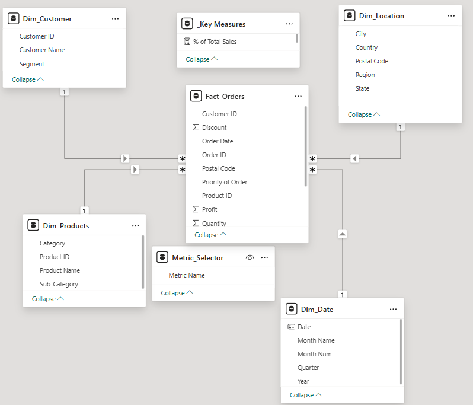

#Dashboard designed for client-facing presentation to SMB owners in Kurdistan Region, Iraq

# Al-Noor Retail Group | Business Performance & Profitability Dashboard

### 📊 Project Overview
**Goal:** Transform raw transactional data into a prescriptive decision-making tool. This project goes beyond descriptive analytics to identify margin leakage, loss-making SKUs, and discount strategy failures.
**Tools:** Power BI, DAX, Power Query.

---

### 🖼️ Dashboard Showcase

**Page 1: Executive Overview**

*High-level view of Net Sales, Profit Margins, and YoY Growth trends.*

**Page 2: Product & Regional Diagnostics**

*Deep-dive matrix and scatter plots identifying "Profit Killers" (High Revenue / Negative Margin).*

**Page 3: Strategic Action Plan**

*Executive summary quantifying the financial uplift of specific interventions.*

---
Clean and well-written already — good technical depth. Here's the enhanced version with your new findings and updated framing:

markdown### 🎯 Business Objective

In a retail environment where revenue can be misleading, 
margin discipline is critical. This dashboard answers 
four core questions:

1. **Portfolio Health:** Which sub-categories are driving 
profit vs. destroying value?
2. **Pricing Strategy:** At what threshold do discounts 
erode profitability?
3. **Regional Performance:** Which regions are above and 
below average margin — and why?
4. **Optimization:** What specific capital reallocations 
will improve the corporate bottom line?

---

### 🔎 Key Findings & Strategic Recommendations

#### 1. The "Revenue Trap" (Unprofitable Sub-Categories)
* **Observation:** The **"Tables"** sub-category generates 
high revenue volume but operates at a negative profit 
margin, creating a **~$17K direct loss**.
* **Diagnosis:** High sales volume ≠ healthy profitability. 
This is a classic "hollow revenue" scenario — the business 
is working harder to lose more money.
* **Action:** Halt inventory replenishment for Tables and 
clear existing stock. Reallocate budget to **"Technology"**, 
which drives **40%+ of total profit** at a 17.4% margin.

#### 2. Discount Strategy Failure — Quantified
* **Observation:** Transaction-level analysis reveals that 
discounts exceeding **50%** consistently yield deeply 
negative margins.
* **Critical Finding:** Moderate discounts (under 50%) are 
net profitable overall. The problem is exclusively 
**extreme discounting above 50%** — which generated 
**-$97,000 in combined losses** between 2019–2022.
* **Nuance:** Transactions with 10–49% discounts remain 
net profitable — meaning the issue is not discounting 
itself, but the absence of a hard ceiling.
* **Policy Recommendation:** Implement a hard cap at 
**40% maximum** for all managers. Any discount above 
this threshold requires owner-level approval.

#### 3. Regional Profitability Divergence
* **Observation:** Sales performance and profit margin 
do not always correlate by region. The **East** region 
leads in revenue volume, but **West** leads in profit 
margin efficiency.
* **Finding:** **South** and **Central** regions are 
operating below the average margin threshold — signaling 
either pricing issues, higher discount rates, or 
unfavorable product mix in those regions.
* **Action:** Investigate discount behavior and product 
mix in South and Central before expanding operations 
there.

#### 4. Combined Financial Uplift Simulation
* **Scenario Modeled:** Two simultaneous interventions:
  * (1) Eliminate the Tables loss-leader (-$17K) and 
  reallocate its $206K revenue stream to Technology.
  * (2) Implement a hard 40% discount cap to eliminate 
  the -$97K in extreme-discount losses.
* **Projected Impact:**
    * **$114,000+** combined positive swing in Net Profit.
    * **$51,000** from inventory reallocation.
    * **Up to $97,000** from discount policy correction.
    * **~2.5–3%** improvement in overall company 
    Profit Margin year-over-year.

---

### 🛠️ Analytical Depth & Technical Implementation

This project demonstrates the transition from data 
visualization to **strategic business consulting** — 
not just showing numbers, but diagnosing problems and 
quantifying solutions.

**Data Modeling (Star Schema)**

*Centralized Star Schema architecture connecting the 
Fact Table (Orders) to Dimensions (People, Returns, Date) 
for optimized query performance and clean measure logic.*

**Analytical Techniques:**
* **Profitability Decomposition:** Breaking down P&L from 
Category → Sub-Category → SKU level to isolate 
loss-making nodes.
* **Revenue Quality Analysis:** Scatter plot ("Whale Chart") 
visualizing Sales Volume (X) vs. Net Profit (Y) — 
identifying high-volume, low-profit products that create 
false revenue confidence.
* **Loss Concentration Analysis:** Top 5 loss-making 
products isolated to prevent "death by a thousand cuts" 
margin erosion.
* **Discount Threshold Analysis:** Transaction-level 
segmentation to identify the exact discount % where 
profitability turns negative — distinguishing between 
healthy moderate discounting and destructive extreme 
discounting.
* **Regional Margin Benchmarking:** Conditional formatting 
using dynamic average as threshold — regions above 
average margin highlighted in teal, below average in red.

**DAX Measures:**
```dax
Profit Margin % = DIVIDE([Total Profit], [Total Sales])

YoY Growth % = 
DIVIDE(
    [Total Sales] - CALCULATE([Total Sales], 
    SAMEPERIODLASTYEAR('Dim_Date'[Date])),
    CALCULATE([Total Sales], 
    SAMEPERIODLASTYEAR('Dim_Date'[Date]))
)

Net Loss from Extreme Discounts = 
CALCULATE(
    SUM(Fact_Orders[Profit]),
    Fact_Orders[Discount] >= 0.5
)

Product Loss Rank = 
RANKX(
    ALLSELECTED('Fact_Orders'[Product Name]),
    [Total Profit],
    ,
    ASC
)
```

**Design Decisions:**
* KELA Agency brand colors throughout — `#2ABFBF` teal, 
`#0D0D0D` near-black, `#FAFAFA` off-white background.
* Red (`#E74C3C`) reserved exclusively for negative 
values and loss indicators — creates instant visual 
language the viewer learns within seconds.
* Every chart includes a plain-language subtitle 
explaining what to look for — designed for 
non-technical business owners, not analysts.
---

### 👥 Intended Audience
* **C-Suite Executives:** For strategic capital allocation.
* **Category Managers:** For SKU rationalization and inventory decisions.
* **Sales Directors:** For discount policy enforcement.
